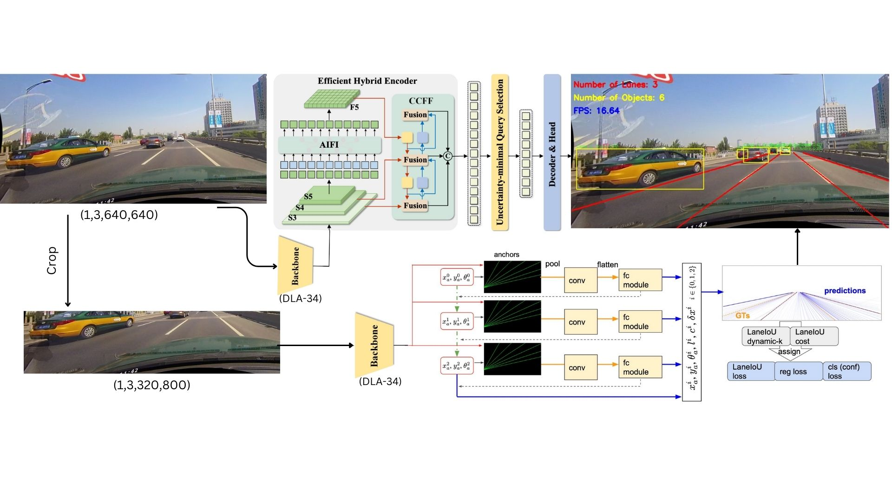
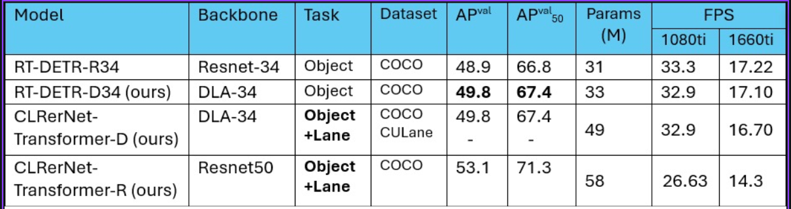
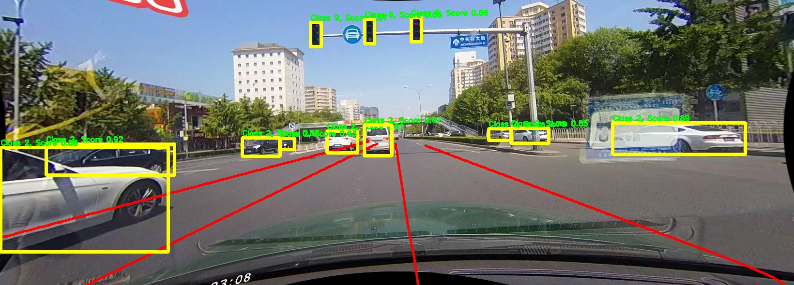
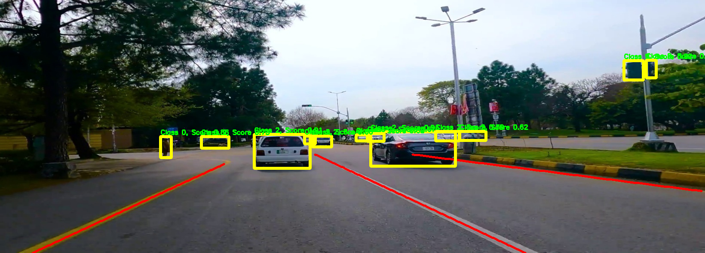

# Advanced Driver Assistance System

The official implementation of our Final Year Project: Transformer Application on Computer Vision: Advanced Driver Assistance System

## What's New


- Added support of streamlit and custom Isalamabad Roads Inference Visualization


## Method

We modify Real Time Detection Transformer by replacing ResNet34 backbone into DLA34 backbone.
We then fuse this modified RT-DETR with CLRerNet to achieve multi modality i.e. Lane Segmentation + Object Detection

<p align="center"> </p>


## Performance

Our modified RT-DETR with DLA34 backbone (i.e RT-DETR-D34) achieves the <b>state-of-the-art performance on COCO benchmark </b> significantly surpassing the original RT-DETR Resnet 34 backbone based results and maintaining the CULane benchmark at the same time!

<p align="center"> </p>

Download the weights: [RT-DETR-D34 (ours)](https://drive.google.com/file/d/1zlp5hFnF8Jfx4aaX1zILa6fB0CA6ONV6/view?usp=sharing), [CLRerNet-Transformer-D34 (ours)](https://drive.google.com/file/d/1mmWenvdfSZ6I4HxXiBLRs6H_4T4U-VxN/view?usp=sharing), [CLRerNet-Transformer-R34 (ours)](https://drive.google.com/file/d/18gaNk7F1wyA16yMpk8WOjRse-GzC-WX7/view?usp=sharing)    
Place the weights in the main folder i.e. ADAS


## Install

Docker environment is recommended for installation:
```bash
docker-compose build --build-arg UID="`id -u`" dev
docker-compose run --rm dev
```


See [Installation Tips](docs/INSTALL.md) for more details.


## Inference on Culane
<p align="center"> </p>

Downdload [culaneyolo.zip](https://drive.google.com/file/d/15zoKQwY6jszATq_7td1OfOUG3Qpy-wR-/view?usp=sharing) and extract it in ADAS/dataset2/culaneyolo
Download culane dataset and place the entire folder in ADAS/dataset2/culane. 
The culane data structure is as follows: 


ADAS/dataset2/culane/

├── annotations_new/
├── driver_23_30frame/
├── driver_37_30frame/
├── driver_100_30frame/
├── driver_161_90frame/
├── driver_182_30frame/
├── driver_193_90frame/
├── laneseg_label_w16/
├── laneseg_label_w16_test/
└── list/


Run the following command to detect the objects and lanes from the image and visualize them:
##### Light Model CLRerNet-Transformer-D34
```bash
python demo/ali.py configs/clrernet/culane/rtdetr_clrernet2.py ClrerNet_Transformer_D14.pth
```
##### Heavy Model CLRerNet-Transformer-R34
```bash
python demo/ali.py configs/clrernet/culane/clrernet_culane_rtdetr.py ClrerNet_Transformer_R14.pth 
```
This will save each frame in ADAS/result_dl folder if not given any --out-file directory

Example Output: [result_dl.zip](https://drive.google.com/file/d/1Mmh3TnwP9Z7YAaUUhhgOx6uSkChW6T6o/view?usp=sharing)

## Inference on Islamabad Roads
<p align="center"> </p>

Download the text file for frames: [isb.txt](https://drive.google.com/file/d/1PHjSLfhfZelG6l8YIfHpvRwOeEQ_Zd8q/view?usp=sharing)
Download the frame: [isb.zip](https://drive.google.com/file/d/1MuFyD5I1Nw6MHURHKsTBcLhPMYd8yrVN/view?usp=sharing)
Extract isb.zip into ADAS/isb folder
Run the following command to detect the objects and lanes from the image and visualize them:

##### Light Model CLRerNet-Transformer-D34
```bash
python tools/Disb.py configs/clrernet/culane/rtdetr_clrernet.py ClrerNet_Transformer_D14.pth isb.txt --out-file=fyp_inference
```

This will save each frame in ADAS/fyp_inference folder if not given any --out-file directory

Example Output: [fyp_inference.zip](https://drive.google.com/file/d/1Q6ZNDAZrpk0pbHWM0lirgIAnUesy353C/view?usp=sharing)

## Train - To be updated

Make sure that the frame difference npz file is prepared as `dataset/culane/list/train_diffs.npz`.<br>
Run the following command to train a model on CULane dataset:

```bash
python tools/train.py configs/clrernet/culane/clrernet_culane_dla34.py
```


## References

* [hirotomusiker/CLRerNet](https://github.com/hirotomusiker/CLRerNet)
* [lyuwenyu/RT-DETR](https://github.com/lyuwenyu/RT-DETR)
* [CULane Dataset](https://xingangpan.github.io/projects/CULane.html)
* [open-mmlab/mmdetection](https://github.com/open-mmlab/mmdetection)
* [optn-mmlab/mmcv](https://github.com/open-mmlab/mmcv)
